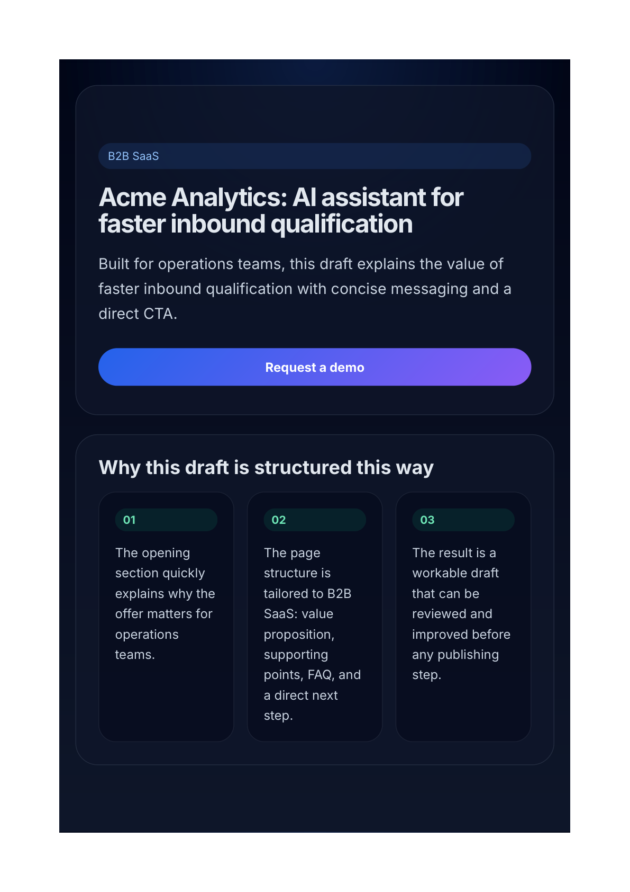

# Landing Brief Builder

Landing Brief Builder is a local-first FastAPI + Vanilla JS app that turns a short product brief into a draft landing page, renders a live preview, and keeps revision history for each saved page.



## What it does
- creates a draft landing page from a short structured brief
- keeps stable slugs with collision handling and Cyrillic transliteration
- stores pages and revision history in local JSON files
- updates existing pages with optimistic conflict checks via `expected_revision`
- renders each saved page through a dedicated preview route

## Tech stack
- FastAPI
- Pydantic v2
- Jinja2
- Vanilla JavaScript
- Pytest
- GitHub Actions CI

## Project structure

```text
landing-brief-builder/
├── app.py
├── landing_builder/
│   ├── api/
│   │   ├── dependencies.py
│   │   ├── errors.py
│   │   └── routes.py
│   ├── domain/
│   │   ├── models.py
│   │   └── schemas.py
│   ├── services/
│   │   └── page_composer.py
│   ├── storage/
│   │   └── page_repository.py
│   ├── templates/
│   │   └── preview.html
│   ├── app_factory.py
│   └── config.py
├── docs/
├── static/
├── tests/
├── .github/workflows/
├── .env.example
├── Makefile
├── pyproject.toml
└── README.md
```

## API overview
- `GET /health` — health check + version
- `GET /api/pages` — list saved pages
- `POST /api/pages` — create and persist a page
- `PUT /api/pages/{slug}` — update an existing page and increment its revision
- `GET /api/pages/{slug}` — fetch a single page
- `GET /api/pages/{slug}/revisions` — list revision history
- `GET /preview/{slug}` — render the current preview

## Local run

```bash
cd landing-brief-builder
python -m venv .venv
source .venv/bin/activate
pip install -e .[dev]
uvicorn app:app --reload --port 8000
```

Open `http://127.0.0.1:8000`.

## Quality checks

```bash
make test
make lint
```

## Design choices
The app stays local-first on purpose. Pages and revision history are stored in JSON so the full workflow is easy to inspect without adding a database or external services.

Persistence writes go through a temporary file, `fsync`, and atomic replace. When an existing storage file is invalid JSON or has the wrong root shape, the repository backs it up and recreates an empty file before continuing.

See `docs/engineering-decisions.md` for the main trade-offs.

## Scope
This repository is a single-user drafting tool, not a publishing platform.

Included:
- structured copy composition from brief inputs
- revision-aware updates
- previewable UI
- local persistence that is easy to inspect and test

Not included:
- authentication or permissions
- collaborative editing
- publishing pipeline or deploy workflow
- analytics or experimentation tooling
